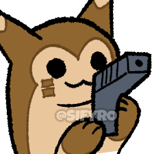

# EliteFurretAI
**The goal of this project is to build a superhuman bot to play Pokemon VGC**. It is not to further research, nor is it to build a theoretically sound approach -- the goal is to be the best that no one ever was. We will only contribute to research or take sound approaches if it will help us towards our ultimate goal.

### Summary of the VGC Problem Space
- In the purest sense, **a VGC battle is an imperfect information zero-sum two player game with a very large simultaneous action space, complex game mechanics, a high degree of stochasticity and an effectively continuous state space**.
    - VGC is an incredibly difficult AI problem. The fact that there is a large pool of top players (and they’re hard to sort) demonstrates the difficulty of this problem even for humans.
- After reading a wide array of literature, **we suggest we should tackle VGC directly** (instead of through Singles) because of the 40x action space, 3000x branching factor and the additional importance given to game interactions. These factors necessitate that an agent more deeply understands game mechanics and be more computationally efficient.
- Given these properties of VGC and top existing bots, **we will attempt to use a model-based search algorithm with depth-limited + heavily pruned search and a Nash Equilibrium-based value function that does not assume unobservable information**. We plan to initialize our agent with human data and train using self-play.
    - There is still quite a lot we need to understand about specifically how VGC behaves in order to make more informed algorithmic choices, and so this approach is very likely to change as we learn more.
- Industry’s dominance in making State of the Art agents demonstrates that **with enough talent, capacity and infrastructure, virtually all problems with VGC’s nature can be solved**. However, assessing the current state of resources available to us, the current bottlenecks for developing a successful agent is (in order):
    - **Talent** – Very few agents have seen dedicated and organized support over a span more than 12 months; having a dedicated and organized team is crucial.
    - **Engine** – Faster pokemon engine with ability to simulate (where we can control RNG)
    - **Capacity** – CPU for generating training data, GPU for inference
    - **Human Training Data** – while not essential, this will accelerate training convergence by orders of magnitude, reduce capacity needs and accelerate our own internal learning speed tremendously. It will also help our bot transition to playing humans more easily.

## Current Proposed Approach
From our synthesis of [avalailable literature](https://docs.google.com/document/d/14menCHw8z06KJWZ5F_K-MjgWVo_b7PESR7RlG-em4ic/edit#heading=h.p6dz1cv0mnpx), we’ve seen:
- Model-free alone is unlikely to produce superhuman performance without the capacity that we don’t have available
- Search is necessary for decision-time planning, and game abstractions are necessary to make search tractable
- The behavior of VGC from a game-theoretic perspective is still unknown, and theory might not help the practical purposes of making a superhuman bot.

Because of this last point, any approach we suggest pre-hoc is very likely to change as we learn more about what works in practice and how VGC behaves. That being said, we feel the best approach will likely be:

Basic Foundation:
- **Policy** – based on Nash Equilibrium using Deep Learning to create the best policy/value networks that generalize to the game well. This allows for most flexibility for decision-time planning.
- **Search** – during decision-time planning, we can explore the following options:
    - Using the above networks directly if sufficiently accurate
    - Using Depth-Limited search
    - Using MCTS
- **Game Abstractions** – these will help speed up both training our networks and our speed. We will explore the following abstractions:
    - Decision Abstractions
        - Using a network to pick top N likely actions from opponents and only rely on search using these
        - Using a network to eliminate exploring states that have low predicted value for our agents
    - State Abstractions
        - Use a network that embeds each state, and use Locality-Sensitive Hashing to quickly eliminate branches to explore if they are very similar to other previously explored
        - Binning HP (exact HP values mostly don’t matter)
        - Binning PP (exact PP values mostly don’t matter)
        - Use a network to predict the opponent’s infostate/the worldstate
    - Chance Abstractions
        - Only explore good luck or bad luck (Athena assumes one RNG roll per turn per player)
        - Ignore unlikely outcomes

**Training Approach**: We will generate data via self-play, guided with human data
- **Self-Play**: given the complex game dynamics and partial observability, we need extraordinary amounts of data, which can only be reasonably generated by self-play. We plan to use MCCFR to generate data for optimal policies (in an abstracted game).
- **Initializing with Human Data**: While not necessary, this will help encode game mechanics, improve performance against humans (by better exploring likely human-caused states)  and drastically speed up training, making this approach feasible. Concretely, we will generate some training samples based on human-like decisions learned from human data.

**Increasing Problem Complexity:** Given the high degree of complexity of the properties VGC has, we believe we should start with more constrained problems, verify our approaches and gradually introduce complexities to overcome computational constraints.

## Why the name EliteFurretAI?
The ultimate goal of this work is to make Furret central to the VGC meta. Because Nintendo refuses to give Furret the buffs it desperately needs, only a superhuman AI will be able to build around this monster and use it in a way that unleashes its latent potential. This bot is the first step to doing so; once it can appropriately consume meta stats and accurately value starting positions, we can use it to start building teams.

Eventually, we hope that this AI can be used to build and use a competitive team centered around Furret -- one that will be deserving of surpassing all Elite Fours, hence the name "EliteFurretAI".

Afterwards, we hope that we can integrate this AI into emulators.

More details on this approach, thinking and understanding that led to this development plan can be found [here](https://docs.google.com/document/d/14menCHw8z06KJWZ5F_K-MjgWVo_b7PESR7RlG-em4ic/edit).

## Contributors & Acknowledgements
It's definitely greedy and presumptuous to acknowledge people before EliteFurretAI amounts to anything, but I do have a couple of people I want to call out that have been instrumental to even getting this project off the ground.
- First and foremost, a huge shoutout to [hsahovic](https://github.com/hsahovic) both for building poke-env, but also teaching me quite a lot about how to code better
- Second, a shoutout to [attraylor](https://github.com/attraylor) who brought me into the Pokemon AI community
- Lastly, a shoutout to [pre](https://github.com/scheibo) for being the engine that keeps the community going, and inspiring in me a new round of motivation to build AI right.
