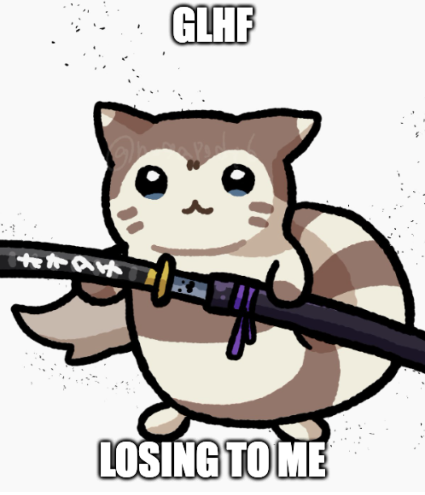

# EliteFurretAI
**The goal of this project is to build a superhuman bot to play Pokemon VGC**. It is not to further research, nor is it to build a theoretically sound approach -- the goal is to be the best that no one ever was. We will only contribute to research or take sound approaches if it will help us towards our ultimate goal.

Table of Contents:

1. [Goals & Priorities](#goals-and-priorities)
2. [Summary of the VGC Problem Space](#summary-of-the-vgc-problem-space)
3. [Current Proposed Approach](#current-proposed-approach)
4. [Multi-Headed Transformer Model](#multi-headed-transformer-model)
5. [Why the name?](#why-the-name-elitefurretai)
6. [Resources](#resources)
7. [Contributors & Acknowledgements](#contributors--acknowledgements)

## Goals and Priorities
This project is pretty big, and so there is a sequence of milestones we want to accomplish:
1. **Basic Foundation**s: We want to build simple utilities extending off of poke-env to make it easier to build a VGC RL or supervised learning bot off-the-shelf for me and researchers.
2. **Build a VGC Bot**: We want to build a bot using the above utilities.
3. **Derive Teambuilding**: Once our bot gets to superhuman, we can use it and a sample of teams in the current Meta to derive an optimal team-building strategy via brute force.
4. **Create Furret-based teams**: With the above, we can contain our bot to force it to have and bring Furret in matchups to help derive the most optimal usage of this monster of a Pokemon. Imagine a world in which Furret dominates a VGC meta!
5. **Incorporate into games**: With a strong bot, playing Pokemon will become intensely challenging and strategic.

### Summary of the VGC Problem Space
- In the purest sense, **a VGC battle is an imperfect information zero-sum two player game with a very large simultaneous action space, complex game mechanics, a high degree of stochasticity and an effectively continuous state space**.
    - VGC is an incredibly difficult AI problem. The fact that there is a large pool of top players (and they’re hard to sort) demonstrates the difficulty of this problem even for humans.
- After reading a wide array of literature, **we suggest we should tackle VGC directly** (instead of through Singles) because of the 40x action space, 3000x branching factor and the additional importance given to game interactions. These factors necessitate that an agent more deeply understands game mechanics and be more computationally efficient.
- Given these properties of VGC and top existing bots, **we will attempt to use a model-based search algorithm with depth-limited + heavily pruned search and a Nash Equilibrium-based value function that does not assume unobservable information**. We plan to initialize our agent with human data and train using self-play.
    - There is still quite a lot we need to understand about specifically how VGC behaves in order to make more informed algorithmic choices, and so this approach is very likely to change as we learn more.
- Industry’s dominance in making State of the Art agents demonstrates that **with enough talent, capacity and infrastructure, virtually all problems with VGC’s nature can be solved**. However, assessing the current state of resources available to us, the current bottlenecks for developing a successful agent is (in order):
    - **Talent** – Very few agents have seen dedicated and organized support over a span more than 12 months; having a dedicated and organized team is crucial.
    - **Engine** – Faster pokemon engine with ability to simulate (where we can control RNG). This is being worked on by [pmarglia](https://github.com/pmariglia/foul-play).
    - **Capacity** – CPU for generating training data, GPU for inference
    - **Human Training Data** – while not essential, this will accelerate training convergence by orders of magnitude, reduce capacity needs and accelerate our own internal learning speed tremendously. It will also help our bot transition to playing humans more easily.

## Current Proposed Approach
From our synthesis of [available literature](https://docs.google.com/document/d/14menCHw8z06KJWZ5F_K-MjgWVo_b7PESR7RlG-em4ic/edit#heading=h.p6dz1cv0mnpx), we’ve gleaned:
- Model-free alone is unlikely to produce superhuman performance without the capacity that we don’t have available
- Search is necessary for decision-time planning, and game abstractions are necessary to make search tractable
- The behavior of VGC from a game-theoretic perspective is still unknown, and theory might not help the practical purposes of making a superhuman bot.

Because of this last point, any approach we suggest pre-hoc is very likely to change as we learn more about what works in practice and how VGC behaves. That being said, we feel the best approach will likely be both of:
- **Policy-based** – based on Nash Equilibrium using Deep Learning to create the best policy/value networks that generalize to the game well. This allows for most flexibility for decision-time planning. These will likely have to be from a combination of classic self-play RL and imitation learning.
- **Search-based** – during decision-time planning, we should expore MCTS guided by our Policy and Value networks. This allows us to better deal with nuances of game mechanics that RL might not be able to fully grasp. We can use different types of game abstractions to speed up this process and make it more tractable. This will unequivocally be critical given the game mechanic complexity and high cost of mistakes in VGC; RL with our current resources will unlikely be sufficient.

Ultimately, we think that Search-based will be the quickest way to get to peak human levels, and that policy-based (or methods that combine policies with search) will get to superhuman performance.

There is quite a lot of complexity in the above, and we encourage you to check out [the doc linked above](https://docs.google.com/document/d/14menCHw8z06KJWZ5F_K-MjgWVo_b7PESR7RlG-em4ic/edit#heading=h.p6dz1cv0mnpx) if you want to learn more about the sequencing of steps and models to build out the above.

### Where am I right now?
Currently, I've built a [supervised deep learning model](https://wandb.ai/caymansimpson/elitefurretai-scovillain/runs/mmhseltv/logs) that predicts a human's action with the following accuracy:
- Teampreview
  - Top-1: 48.8%
  - Top-3: 91.4%
  - Top-5: 99.2%
- Move Choice
  - Top-1: 16.6%
  - Top-3: 33.9%
  - Top-5: 42.4%

I'm going to start exploring a sweep on parameters to optimize the model. My hope is to get it's move choice predictions to Top-3 50%. Then, I will then use it to improve RL, which I will approach next.

## Why the name EliteFurretAI?
As mentioned above, the penultimate goal of this work is to make Furret central to the VGC meta. Because Nintendo refuses to give Furret the Simple/Shadow Tag/Pure Power/Adaptability/Prankster buffs it desperately needs, only a superhuman AI will be able to build around this dark horse and use it in a way that unleashes its latent potential. This bot is the first step to doing so; once it can appropriately accurately value starting positions, we can use it to start building teams with basic meta stats.

Eventually, we hope that this AI can be used to build and use a competitive team centered around Furret -- one that will be deserving of surpassing all Elite Fours, and even potentially replacing in-game AI. Hence the name "EliteFurret". We chose to stick with AI at the end of the name so players internalize they are being owned by a robot that profoundly understands the capabilities of this monster.

## Resources
More details on this approach, thinking and understanding that led to everything in this README can be found [here](https://docs.google.com/document/d/14menCHw8z06KJWZ5F_K-MjgWVo_b7PESR7RlG-em4ic/edit).

## Contributors & Acknowledgements
It's definitely presumptuous to acknowledge people before EliteFurretAI amounts to anything, but I do have a couple of people I want to call out that have been instrumental to even getting this project off the ground.
- First and foremost, a huge shoutout to [hsahovic](https://github.com/hsahovic) both for building poke-env, but also teaching me quite a lot about how to code better
- Second, a shoutout to [attraylor](https://github.com/attraylor) who brought me into the Pokemon AI community
- Lastly, a shoutout to [pre](https://github.com/scheibo) for being the engine that keeps the community going, and inspiring in me a new round of motivation to build AI right.

